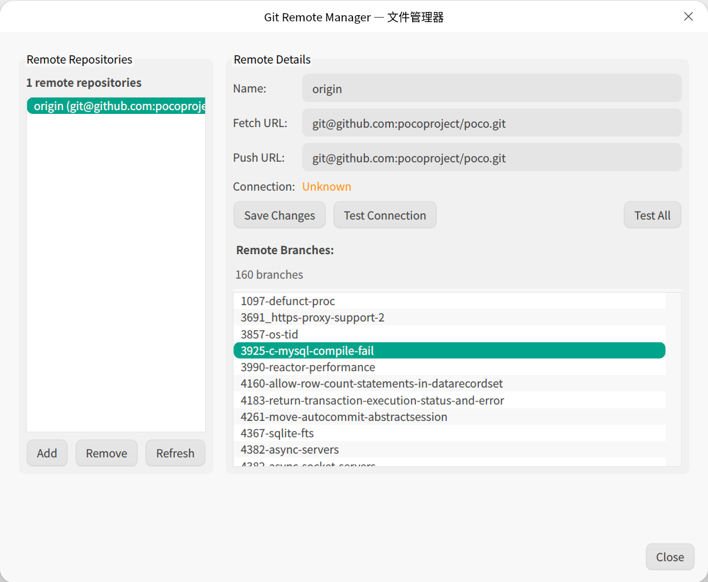

# DDE文件管理器版本控制工具

本项目目的是为了为DDE文件管理器开发版本控制工具插件，当前仅开发了Git插件，为深度桌面环境（DDE）的文件管理器提供完整的Git集成功能。

## 🌟 功能特性

### 📊 智能状态可视化


- **文件状态角标**：实时显示文件的Git状态
  - 🟢 正常版本（已提交）
  - 🔵 本地修改（已暂存）
  - 🟡 本地修改（未暂存）
  - ➕ 新增文件
  - ➖ 已删除文件
  - ⚠️ 冲突文件
  - 📁 目录状态汇总

### 🖱️ 全面的右键菜单集成

#### 单文件操作


对选中的文件可进行以下操作（根据文件状态智能启用/禁用）：

- **Git Add** - 将文件添加到暂存区
- **Git Remove** - 从版本控制中移除文件
- **Git Revert** - 还原文件到最后提交状态
- **Git Log...** - 查看文件的提交历史
- **Git Blame...** - 查看文件的逐行作者信息
- **Git Diff...** - 查看文件差异
- **Git Stash File** - 暂存单个文件的更改

#### 多文件批量操作
- **Git Add Selected** - 批量添加选中文件
- **Git Remove Selected** - 批量移除选中文件
- **Git Revert Selected** - 批量还原选中文件

#### 仓库级操作


在Git仓库目录的空白区域右键可进行以下操作：

**基础操作**：

- **Git Status...** - 查看仓库状态概览
- **Git Log...** - 查看完整的仓库提交历史
- **Git Commit...** - 提交暂存的更改

**分支管理**：
- **Git Checkout...** - 切换分支或标签（支持创建新分支）
- **Git Branch Comparison...** - 比较不同分支的差异

**同步操作**：
- **Git Pull...** - 高级拉取对话框（支持多种策略）
- **Git Push...** - 高级推送对话框（支持强制推送、标签等）
- **Git Remote Manager...** - 远程仓库管理

**高级功能**：

- **Git Stash** - 快速创建stash
- **Git Stash Manager...** - 完整的stash管理界面

### 🖥️ 交互界面

#### Git Log 查看器


采用现代化三栏布局设计：

- **左侧提交列表**：
  - 图形化分支展示
  - 提交信息、作者、日期
  - 远程状态指示（领先/落后/同步）
  - 无限滚动加载
  
- **右上提交详情**：
  - 完整的提交信息和元数据
  - 提交统计信息
  - 作者和时间信息
  
- **右下文件差异**：
  - 语法高亮的diff视图
  - 文件变更统计
  - 支持文件预览

**高级功能**：
- **搜索**：实时搜索提交消息、作者、哈希
- **分支过滤**：可搜索的分支选择器
- **右键菜单**：丰富的上下文操作
- **浏览器集成**：支持在浏览器中打开commit（GitHub/GitLab等）

#### Git Commit 对话框


提交界面：

- **智能文件管理**：
  - 分离显示暂存区和工作区文件
  - 支持文件的暂存/取消暂存操作
  - 文件状态图标和统计信息
  
- **提交消息编辑**：
  - 多行文本输入支持
  - 提交消息模板
  - 实时字符计数
  
- **高级选项**：
  - Amend模式（修改最后一次提交）
  - Allow Empty（允许空提交）
  - 文件预览功能

#### Git Status 对话框


全面的仓库状态管理：

- **状态概览**：显示暂存、修改、未跟踪文件统计
- **文件操作**：支持暂存、取消暂存、重置、提交等操作
- **差异预览**：实时显示选中文件的差异
- **批量操作**：支持多文件选择和批量处理

#### Git Push/Pull 对话框


同步操作界面：

**Push对话框**：
- **仓库状态概览**：显示未推送提交和远程状态
- **高级选项**：强制推送、推送标签、设置上游等
- **安全机制**：Force with lease、预演模式
- **提交预览**：显示即将推送的提交列表

**Pull对话框**：
- **拉取策略选择**：merge、rebase、fast-forward
- **远程分支选择**：支持多远程仓库
- **高级选项**：自动stash、prune、预演模式
- **冲突处理**：智能冲突检测和处理建议

#### Git Checkout 对话框


分支切换界面：

- **标签页设计**：
  - 分支标签页：本地和远程分支，当前分支高亮
  - 标签标签页：所有Git标签
- **新建分支**：支持在checkout时创建新分支
- **搜索功能**：可搜索的分支/标签选择器
- **安全检查**：自动检测未提交更改并提供stash选项

#### Git Stash 管理器


stash管理功能：

- **Stash列表**：显示所有stash及其信息
- **内容预览**：实时显示stash的差异内容
- **全面操作**：Apply、Apply & Keep、Delete、Create Branch
- **右键菜单**：丰富的上下文操作
- **键盘快捷键**：提高操作效率

#### Git Blame 对话框


GitHub风格的blame界面：

- **逐行显示**：每行代码的作者、时间和提交信息
- **颜色编码**：不同提交使用不同颜色区分
- **交互功能**：点击提交哈希查看详细信息
- **右键菜单**：支持查看提交详情等操作

#### Git 远程仓库管理器



远程仓库管理：

- **远程列表**：显示所有配置的远程仓库
- **连接测试**：实时测试远程仓库连接状态
- **CRUD操作**：添加、删除、重命名、修改URL
- **批量操作**：支持多个远程仓库的批量管理

#### Git 文件预览对话框


在文件item上按下空格键，可进行文件查看功能：

- **多模式预览**：支持文本、图片、Markdown等格式
- **历史版本**：查看文件在特定提交时的内容
- **语法高亮**：代码文件的语法高亮显示
- **差异对比**：与当前版本的差异对比

### 🔧 技术架构

#### 核心组件
- **GitEmblemIconPlugin**：文件状态角标显示系统
- **GitMenuPlugin**：右键菜单集成系统
- **GitWindowPlugin**：窗口事件监听和状态同步
- **GitOperationService**：统一的Git操作服务
- **GitFileSystemWatcher**：实时文件系统监控

#### 状态管理
- **Global::Cache**：线程安全的Git状态缓存系统
- **GitStatusParser**：Git状态解析和文件名编码处理
- **GitCommandExecutor**：异步Git命令执行器
- **实时同步**：100ms内响应文件状态变化

#### 数据管理
- **GitLogDataManager**：提交历史数据管理和缓存
- **GitLogSearchManager**：智能搜索和过滤功能
- **GitStashUtils**：Stash操作工具集
- **GitOperationUtils**：通用Git操作工具

#### UI组件系统
- **SearchableBranchSelector**：可搜索的分支选择器
- **LineNumberTextEdit**：带行号的文本编辑器
- **GitDiffSyntaxHighlighter**：差异语法高亮器
- **CharacterAnimationWidget**：加载动画组件
- **MarkdownRenderer**：Markdown渲染器

## 🚀 安装与构建

#### 依赖要求
- **Qt6** (Core, Widgets, Gui, Core5Compat)
- **dfm-extension** 开发库
- **Git** 命令行工具 (≥2.0)
- **CMake** 3.14+
- **现代C++编译器**（支持C++17）

#### 构建步骤

1. 安装依赖

```bash
$ cd dde-file-manager-vcs-plugin
$ sudo apt build-dep ./
```

2. 构建

```bash
$ cmake -B build -DCMAKE_INSTALL_PREFIX=/usr
$ cmake --build build -j$(nproc)
```

3. 安装

```bash 
$ sudo cmake --build build --target install
```

#### 打包

本地构建 debian 包：

```bash
dpkg-buildpackage -us -uc -nc -b -j$(nproc) 
```

## 🔮 未来规划

- [ ] refactor：参考 rabbitVCS, 重构为多进程架构
- [ ] refactor：适配 Qt5
- [ ] feat：svn 插件
- [ ] feat：接入 AI
- [ ] feat：gitdiffdialog 使用双行号列
- [ ] feat：文件视图支持树形列表视图
- [ ] bug：部分场景 git 状态角标异常

## 📄 许可证

本项目采用开源许可证发布，详见[LICENSE](LICENSE)文件。

---

**注意**：本插件需要DDE文件管理器支持，当前由于 Qt 版本原因，仅支持 Deepin v25。请确保系统版本兼容。推荐在最新版本的深度操作系统上使用以获得最佳体验。
